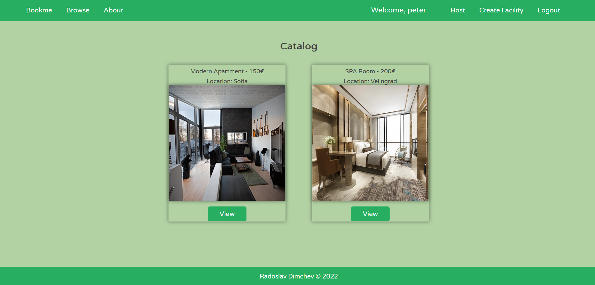
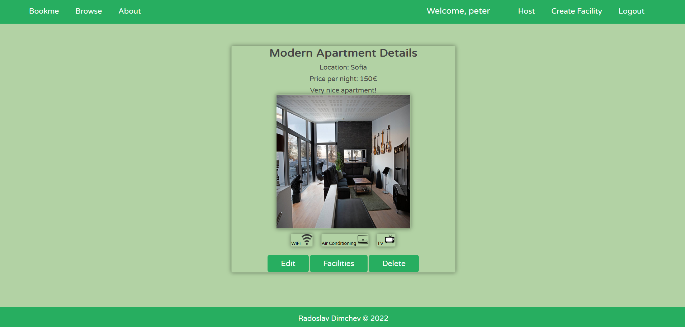
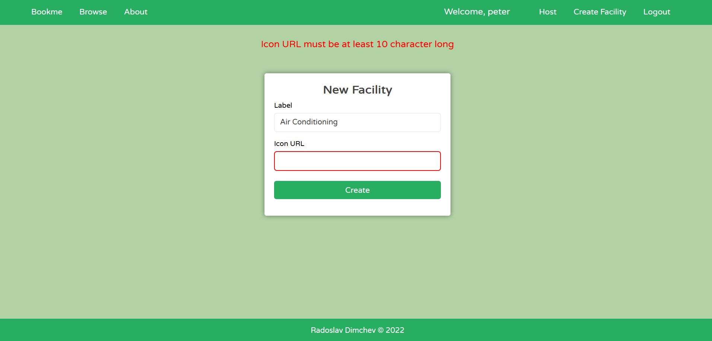

# Bookme

Find accommodation or offer a room!

## Details
The app is based on `Node.js + Express.js + Hanldlebars + MongoDB`

Used libraries `mongoose, bcrypt, jsonwebtoken, cookie-parser, express-validator`

## Usage
`clone repo` `npm i` `npm start`
- username - peter
- password - 123

## Features
- roles - [user, admin]
- guards - [hasUser, hasRole, isOwner]
- collections - [many to many, one to many]
- preload data

## User

### Logged out
- view home, about, rooms and details
- login, register

### Logged in
- all logged out func
- host a room
- edit, delete, add facilities for own rooms
- logout
  
### Admin
- all logged in func
- create facilities

## Screenshots

